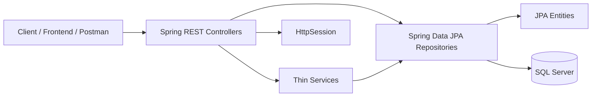
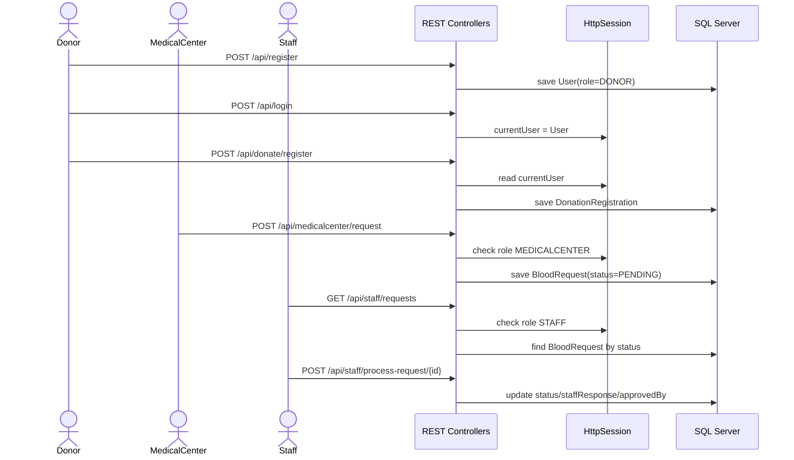
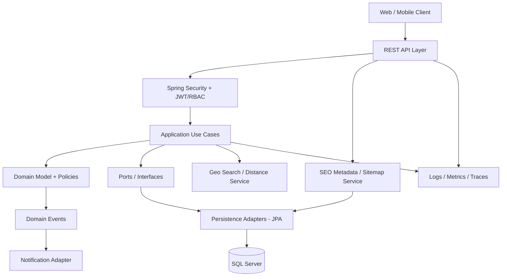
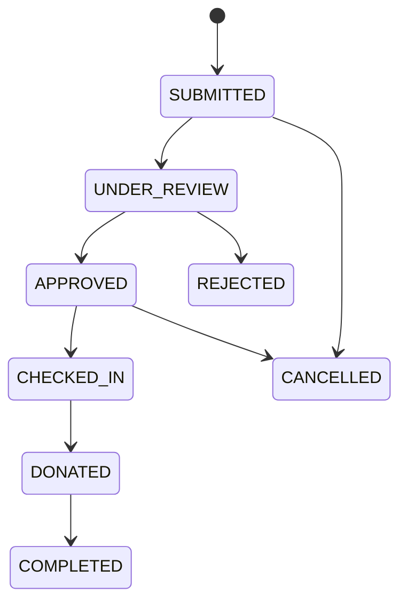
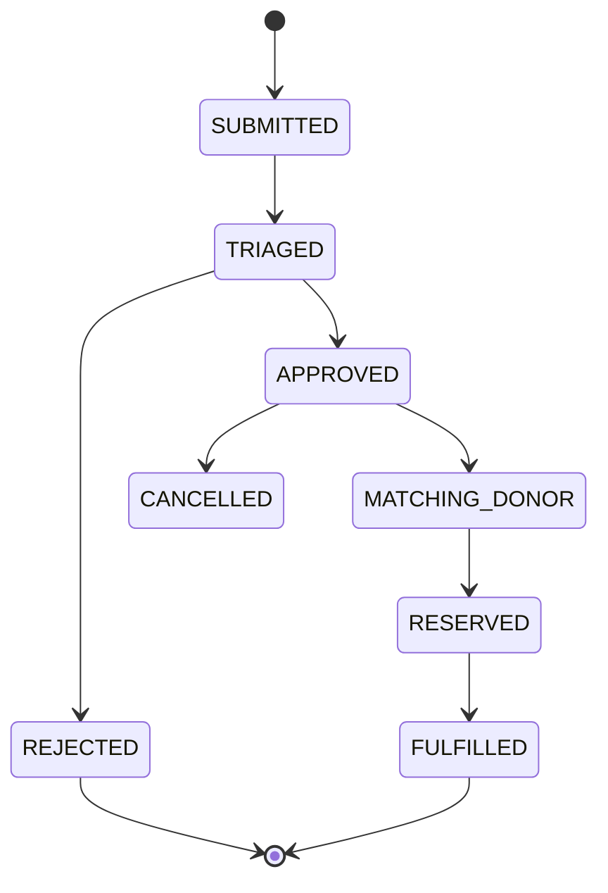

# Blood Donation System - Architecture Review and Upgrade Plan

## 1. Executive summary

Dự án hiện tại là một Spring Boot monolith nhỏ, phù hợp mức prototype hoặc bài demo CRUD. Các khái niệm nghiệp vụ chính đã xuất hiện: người hiến máu, nhân viên, trung tâm y tế, yêu cầu máu, địa điểm và lịch hiến máu. Tuy nhiên kiến trúc hiện đang đi theo kiểu technical-layer đơn giản `controller -> service -> repository -> entity`, chưa đủ cho chuẩn doanh nghiệp.

Định hướng hợp lý nhất là nâng cấp thành **modular monolith theo domain**, áp dụng **Clean Architecture / Hexagonal Architecture nhẹ**, tách rõ API contract, application use case, domain model, persistence adapter, security, observability và migration. Chưa nên tách microservices ngay vì domain còn nhỏ, test chưa đủ và nghiệp vụ chưa ổn định.

Mức hiện tại ước lượng: **3/10** cho production readiness.
Mục tiêu sau nâng cấp: **8-9/10** với modular monolith chuẩn doanh nghiệp.
Mốc 10/10 chỉ nên đặt khi có thêm CI/CD, monitoring thực tế, security hardening, audit, migration dữ liệu, test coverage tốt và vận hành production.

## 2. Technology review

Stack hiện tại:

- Java 21.
- Spring Boot 3.5.3.
- Spring Web MVC.
- Spring Data JPA / Hibernate.
- SQL Server JDBC.
- Lombok.
- Springdoc OpenAPI.
- JUnit / Spring Boot Test.

Thiếu cho chuẩn doanh nghiệp:

- Spring Security: authentication, authorization, password hashing, role policy.
- Jakarta Bean Validation implementation qua `spring-boot-starter-validation`.
- Database migration: Flyway hoặc Liquibase.
- Test database: H2/Testcontainers hoặc SQL Server container.
- Observability: Spring Boot Actuator, Micrometer, structured logging.
- API contract chuẩn: DTO, response envelope hoặc Problem Details.
- CI/CD pipeline và quality gate.
- Environment config: dev/test/prod profile, secret qua env var.

## 3. Current architecture

### Current package structure

```text
com.nhutruong.blood
|-- controller
|-- entity
|-- exception
|-- repository
|-- service
|   `-- imple
`-- BloodApplication
```

### Current system diagram



### Current API/business flow



## 4. Key issues found

### 4.1 Security risks

- Password is stored and compared as plain text.
- Session-based authentication is implemented manually in controllers.
- No Spring Security filter chain, no centralized authorization.
- Login returns detailed error messages, which can leak whether an email exists.
- User entity is returned directly from `/api/me`, exposing internal fields such as password unless serialization is controlled.

### 4.2 Controller owns too much responsibility

Controllers currently handle:

- Request parsing.
- Session access.
- Role checking.
- Business decisions.
- Repository calls.
- Response text.

This makes behavior hard to test, hard to reuse and easy to break when adding mobile/frontend clients.

### 4.3 Domain model is not stable enough

- `BloodRequest.status` is a `String`; it should be an enum/state machine.
- `BloodRequest.urgency` is a `String`; it should be an enum.
- `DonationRegistration.medicalCenter` is a `String`, while blood request uses `User medicalCenter`; this inconsistency will hurt reporting and permissions.
- Blood group is represented as `String`; should be enum/value object.
- Entity classes are used as request bodies, causing API contract and persistence model to be tightly coupled.

### 4.4 Persistence/configuration risks

- `spring.jpa.hibernate.ddl-auto=update` is unsafe for controlled production schema changes.
- Database username/password are hardcoded.
- No `application-dev.properties`, `application-test.properties`, `application-prod.properties`.
- Tests depend on the local SQL Server configuration.
- Current `mvn test` fails because Spring context tries to connect to SQL Server and login for user `sa` fails.

### 4.5 Error handling and API consistency

- Several endpoints return plain strings for both success and error.
- Unauthorized cases sometimes return empty lists instead of `401/403`.
- Not found sometimes returns a string instead of `404`.
- No consistent error code, trace id or validation error structure.

### 4.6 Maintainability issues

- Field injection with `@Autowired`; use constructor injection.
- Service implementation package is named `imple`; should be `impl`.
- Mixed encoding display in comments/messages should be normalized as UTF-8.
- No audit fields: `createdAt`, `updatedAt`, `createdBy`, `updatedBy`.
- No pagination/filtering for list APIs.
- No integration tests for use cases.

## 5. Recommended enterprise target architecture

Use a modular monolith with domain-oriented packages:

```text
com.nhutruong.blood
|-- BloodApplication.java
|-- shared
|   |-- api
|   |   |-- ApiResponse.java
|   |   |-- ErrorResponse.java
|   |   `-- PageResponse.java
|   |-- config
|   |   |-- OpenApiConfig.java
|   |   |-- JpaAuditingConfig.java
|   |   `-- SecurityConfig.java
|   |-- exception
|   |   |-- BusinessException.java
|   |   |-- ErrorCode.java
|   |   `-- GlobalExceptionHandler.java
|   |-- persistence
|   |   `-- AuditableEntity.java
|   `-- security
|       |-- CurrentUser.java
|       |-- JwtAuthenticationFilter.java
|       `-- PermissionEvaluator.java
|-- identity
|   |-- api
|   |   |-- AuthController.java
|   |   `-- UserController.java
|   |-- application
|   |   |-- AuthService.java
|   |   |-- UserService.java
|   |   `-- dto
|   |-- domain
|   |   |-- User.java
|   |   |-- Role.java
|   |   |-- BloodGroup.java
|   |   `-- UserStatus.java
|   `-- infrastructure
|       |-- UserRepository.java
|       `-- UserMapper.java
|-- donation
|   |-- api
|   |-- application
|   |-- domain
|   `-- infrastructure
|-- bloodrequest
|   |-- api
|   |-- application
|   |-- domain
|   `-- infrastructure
|-- geo
|   |-- application
|   |   `-- DistanceService.java
|   `-- domain
|       `-- GeoPoint.java
|-- seo
|   |-- api
|   |   `-- SeoController.java
|   |-- application
|   |   |-- SeoService.java
|   |   `-- dto
|   `-- domain
|-- medicalcenter
|   |-- api
|   |-- application
|   |-- domain
|   `-- infrastructure
`-- notification
    |-- application
    |-- domain
    `-- infrastructure
```

### Target system diagram



### Target module responsibilities

| Module | Responsibility |
| --- | --- |
| `identity` | User, role, login, registration, token, account lifecycle |
| `medicalcenter` | Medical center profile, staff ownership, facility metadata |
| `donation` | Donation campaign/location/schedule/registration/check-in/approval |
| `bloodrequest` | Blood request lifecycle from medical center to staff decision |
| `inventory` | Blood unit inventory, stock movement, expiry, reservation |
| `notification` | Email/SMS/in-app notifications |
| `geo` | Coordinate storage, nearby search, distance calculation, map/search integration |
| `seo` | Public metadata, canonical URLs, sitemap, robots, structured data |
| `shared` | Common exceptions, API response, security helpers, auditing |

### SEO and Geo target capabilities

SEO and Geo should be first-class public discovery capabilities, not frontend-only details.

Geo requirements:

- Store latitude/longitude for donation locations and medical centers.
- Validate coordinate ranges: latitude `-90..90`, longitude `-180..180`.
- Support nearby search by user coordinate and radius.
- Return distance in kilometers in public location APIs.
- Add database indexes for `published`, `slug`, latitude and longitude.
- Later upgrade to SQL Server geography indexes when schema changes are managed by Flyway.

SEO requirements:

- Every public donation location has a stable `slug`.
- Every public page/resource has `seoTitle`, `seoDescription` and canonical URL.
- Generate `robots.txt` and `sitemap.xml`.
- Expose metadata endpoint for frontend SSR/SPA integration.
- Generate schema.org structured data, including `GeoCoordinates` for public locations.
- Keep SEO URLs independent from database IDs.

## 6. Recommended design patterns

Use these patterns pragmatically:

- Layered architecture: API -> Application -> Domain -> Infrastructure.
- Modular monolith: split by bounded context, not by technical folder only.
- DTO pattern: never expose JPA entity as API request/response.
- Mapper pattern: MapStruct or hand-written mappers for entity/DTO conversion.
- Repository pattern: Spring Data JPA stays in infrastructure.
- Use case/service pattern: each important business action has a clear application method.
- Policy/specification pattern: eligibility rules, role rules, request transition rules.
- State machine pattern: blood request and donation registration statuses.
- Domain event pattern: after approval/rejection/registration, emit event for notification/audit.
- Strategy pattern: geo provider integration, SEO metadata source, notification channel, donor matching, blood allocation priority.
- Value object pattern: `GeoPoint`, `Slug`, `BloodGroup`.
- Factory method: create valid aggregate objects with default status and timestamps.

## 7. Target domain lifecycle

### Donation registration lifecycle



### Blood request lifecycle



## 8. Recommended database model direction

Minimum production-grade entities:

- `users`: identity and profile.
- `medical_centers`: facility profile, linked to owner user.
- `staff_profiles`: staff metadata and assigned center.
- `donation_locations`: location created by medical center.
- `donation_locations.latitude`, `donation_locations.longitude`: coordinates for nearby search.
- `donation_locations.slug`: stable public SEO URL key.
- `donation_locations.seo_title`, `donation_locations.seo_description`: public metadata.
- `donation_schedules`: time slot, capacity, status.
- `donation_registrations`: donor registration lifecycle.
- `blood_requests`: request from medical center.
- `blood_inventory`: stock by blood group/component/expiry.
- `blood_units`: traceable units collected from donations.
- `audit_logs`: who did what and when.
- `notifications`: delivery record.

Important constraints:

- Unique email.
- Enum columns for role, blood group, urgency, status.
- Foreign keys for medical center, staff, donor and schedule.
- Indexes on status, blood group, urgency, created date.
- Unique index on public `slug`.
- Indexes on `published`, latitude and longitude for location discovery.
- Optimistic locking via `@Version` for request/inventory updates.

## 9. Refactor roadmap

### Phase 1 - Stabilize foundation

- Add validation starter.
- Add `application-dev.properties`, `application-test.properties`, `application-prod.properties`.
- Move DB credentials to environment variables.
- Replace `ddl-auto=update` with Flyway migrations.
- Add H2/Testcontainers test profile.
- Make `mvn test` pass without local SQL Server.
- Normalize UTF-8 encoding.

### Phase 2 - Secure identity

- Add Spring Security.
- Hash password with BCrypt.
- Replace manual `HttpSession` checks with authenticated principal and method security.
- Prevent password serialization.
- Add role-based access control for DONOR, STAFF, MEDICALCENTER, ADMIN.

### Phase 3 - API contract cleanup

- Introduce request/response DTOs.
- Stop accepting JPA entities as `@RequestBody`.
- Return `ResponseEntity` with correct status codes.
- Implement consistent error model.
- Add OpenAPI annotations per API group.

### Phase 4 - Domain modules

- Move code into domain modules: `identity`, `donation`, `bloodrequest`, `medicalcenter`, `shared`.
- Put business rules in application/domain services.
- Add enums/value objects: `BloodGroup`, `BloodRequestStatus`, `DonationRegistrationStatus`, `Urgency`.
- Add transaction boundaries on use cases.

### Phase 5 - Enterprise workflows

- Add staff approval workflow.
- Add donor eligibility rules.
- Add schedule capacity rules.
- Add inventory and donor matching.
- Add public geo search for donation locations and medical centers.
- Add SEO metadata, sitemap, robots and structured data endpoints.
- Add notification events.
- Add audit log.

### Phase 6 - Quality gate

- Unit tests for domain rules.
- Service tests for use cases.
- Controller tests with MockMvc.
- Repository tests with Testcontainers.
- CI pipeline: build, test, coverage, static analysis.
- Add Actuator health/readiness endpoints.

## 10. Suggested next code changes

The first safe implementation batch should be:

1. Add `spring-boot-starter-validation`, `spring-boot-starter-security`, `spring-boot-starter-actuator`, Flyway and a test DB dependency.
2. Create `shared.exception`, `shared.api`, `shared.security`.
3. Create DTOs for auth, donation registration and blood request.
4. Refactor `AuthController` and `AuthService` first because security is the largest risk.
5. Make tests pass using a dedicated `test` profile.

Do not start with microservices. The better enterprise path is a strong modular monolith first; split services later only when deployment scale, team ownership or data ownership demands it.
