# Blood Donation Community - Enterprise Business & Workflow Design

## 1. Executive Summary

This document redesigns the Blood Donation Community business domain for production-level healthcare operations. The target is a national blood donation platform connecting donors, recipients, hospitals, medical centers, staff, volunteers, logistics partners, and government/system administrators.

The current system already contains early modules for:

- Identity: user, role, registration, login.
- Donation: location, schedule, registration, eligibility check.
- Blood Request: medical center request and staff approval.
- Geo: latitude/longitude and nearby location search.
- SEO: metadata, sitemap, robots.

Production gaps:

- No full RBAC/permission model.
- No hospital/medical center organization model.
- No inventory, quarantine, reservation, release, destruction, or FEFO/FIFO logic.
- No medical examination workflow.
- No emergency request triage.
- No donor matching engine.
- No transportation/cold-chain tracking.
- No notification orchestration.
- No certificate/reward/volunteer/audit/report/analytics modules.
- No complete state machines for healthcare operations.

## 2. Business Requirements

### 2.1 Core Objectives

- Enable citizens to donate blood safely and conveniently.
- Enable hospitals to request blood and track fulfillment.
- Enable blood centers to operate campaigns, schedules, collection, testing, storage, reservation, transportation, and dispatch.
- Enable medical staff to perform check-in, examination, approval, collection, and bag tracking.
- Enable administrators to manage identity, RBAC, organizations, compliance, audit, reports, analytics, SEO, and geo data.
- Support emergency workflows with donor matching and multi-channel alerts.

### 2.2 Non-Functional Requirements

- Availability: 99.9% target for public and hospital request APIs.
- Auditability: all sensitive actions must have immutable audit logs.
- Security: RBAC, least privilege, MFA for staff/admin, encrypted secrets, password hashing.
- Privacy: medical data access must be role-scoped and logged.
- Performance: nearby search and inventory lookup must respond quickly under emergency load.
- Reliability: blood inventory transitions must be transactional and versioned.
- Compliance: retention, traceability, consent, and medical decision records.
- Accessibility: WCAG AA for all user-facing workflows.

## 3. Current Domain Analysis

### 3.1 Current Entities

| Entity | Current responsibility | Gap |
| --- | --- | --- |
| `User` | Identity, role, blood group | Needs organization memberships, verification, status, MFA, profile separation |
| `DonationLocation` | Place for donation | Needs geo object, public SEO, operating hours, capacity, owner organization |
| `DonationSchedule` | Donation time | Needs slots, capacity, booking rules, staff assignment |
| `DonationRegistration` | Donor appointment intent | Needs eligibility, check-in, examination, collection, deferral states |
| `BloodRequest` | Medical center blood request | Needs quantity, component, reservation, fulfillment, transport, emergency flow |

### 3.2 Current Relationships

- User creates donation locations.
- Donation location has donation schedules.
- Donor creates donation registration.
- Medical center user creates blood request.
- Staff user approves/rejects blood request.

### 3.3 Current Business Rules

- Donor registration validates age/weight roughly.
- Eligibility checker returns eligible/review/deferred.
- Staff can approve/reject blood requests.
- Nearby search uses latitude/longitude.
- SEO metadata and sitemap exist for public locations.

### 3.4 Current Workflow Limitation

Current workflow stops before real healthcare operations:

Donor registers -> creates donation registration -> staff approval is not fully modeled -> no examination -> no blood collection -> no inventory -> no testing -> no reservation -> no dispatch -> no transport -> no completion.

## 4. Target Bounded Contexts

```text
identity
rbac
organization
hospital
medicalcenter
donation
medicalexamination
inventory
bloodrequest
matching
emergency
transportation
notification
volunteer
certificate
reward
audit
report
analytics
geo
seo
shared
```

## 5. DDD Design

### 5.1 Aggregates

| Bounded context | Aggregate root | Key entities | Value objects |
| --- | --- | --- | --- |
| Identity | User | UserProfile, DeviceSession, VerificationToken | Email, PhoneNumber, PasswordHash, UserId |
| RBAC | Role | Permission, Policy, RoleAssignment | PermissionCode, Scope |
| Organization | Organization | OrganizationMember, OrganizationVerification | OrganizationCode, Address, TaxCode |
| Hospital | Hospital | Department, HospitalInventoryView | HospitalLicense, ContactPoint |
| Medical Center | MedicalCenter | StaffAssignment, CenterCapability | CenterCode, OperatingHours |
| Donation | Campaign | CampaignLocation, CampaignSchedule | CampaignCode, Capacity, TimeWindow |
| Donation | Appointment | AppointmentSlot, AppointmentReminder | AppointmentCode |
| Medical Examination | Examination | ScreeningAnswer, VitalSign, DeferralReason | BloodPressure, Hemoglobin, Temperature |
| Inventory | BloodUnit | LabTest, StorageRecord, ReservationLine | BloodGroup, ComponentType, ExpiryDate, BagCode |
| Inventory | InventoryBatch | BatchMovement, StockBalance | StorageLocation, Quantity |
| Blood Request | BloodRequest | RequestedComponent, ApprovalDecision, FulfillmentLine | Urgency, RequiredBy |
| Matching | MatchRun | DonorCandidate, MatchScore | DistanceKm, PriorityScore |
| Emergency | EmergencyRequest | TriageDecision, EmergencyAlert | EmergencyLevel |
| Transportation | Shipment | Package, RouteCheckpoint, Handover | TemperatureRange, Route |
| Notification | Notification | DeliveryAttempt, TemplateBinding | Channel, Recipient |
| Volunteer | VolunteerProfile | AvailabilitySlot, Assignment | Skill, Availability |
| Certificate | Certificate | CertificateTemplate | CertificateNumber |
| Reward | RewardAccount | Badge, PointTransaction | PointAmount |
| Audit | AuditEvent | AuditMetadata | Actor, EntityRef, IpAddress |
| Report | ReportJob | ReportFile | DateRange, ReportType |
| Analytics | MetricSnapshot | DashboardWidget | MetricCode |
| Geo | GeoPlace | RouteEstimate | GeoPoint, Distance, TravelTime |
| SEO | SeoPage | SitemapEntry | Slug, CanonicalUrl, MetaDescription |

### 5.2 Aggregate Boundaries

- `BloodUnit` owns test status, component, expiry, quarantine/release/destruction state.
- `BloodRequest` owns request approval, reservation, fulfillment and close state.
- `Appointment` owns donor booking state, but does not own medical examination result.
- `Examination` owns health screening and eligibility decision.
- `Shipment` owns cold-chain route, handovers and delivery state.
- `AuditEvent` is append-only and not edited by business modules.

## 6. ERD

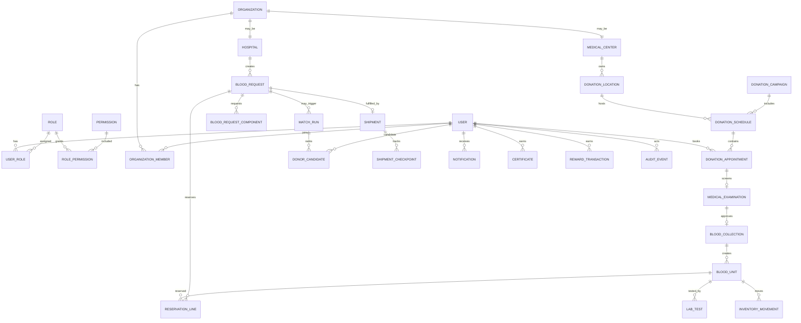

## 7. Database Design

### 7.1 Core Tables

| Table | Purpose |
| --- | --- |
| `users` | Login identity and status |
| `user_profiles` | Personal donor/recipient details |
| `roles`, `permissions`, `user_roles`, `role_permissions` | RBAC |
| `organizations`, `organization_members` | Hospitals, centers, partners |
| `hospitals` | Hospital-specific license/contact metadata |
| `medical_centers` | Blood center capability and operations |
| `donation_locations` | Public and operational locations with geo/SEO |
| `donation_campaigns` | Campaign setup and lifecycle |
| `donation_schedules` | Date/time slots and capacity |
| `donation_appointments` | Donor bookings |
| `medical_examinations` | Screening, vitals, eligibility decision |
| `blood_collections` | Actual collection session |
| `blood_units` | Traceable blood units and components |
| `lab_tests` | Safety testing and result |
| `inventory_movements` | Stock movement ledger |
| `reservations` / `reservation_lines` | Blood reserved for requests |
| `blood_requests` / `blood_request_components` | Hospital needs |
| `match_runs` / `donor_candidates` | Donor matching output |
| `emergency_requests` | Emergency intake and triage |
| `shipments` / `shipment_checkpoints` | Transportation and cold chain |
| `notifications` / `delivery_attempts` | Message delivery |
| `volunteer_profiles` / `volunteer_assignments` | Volunteer management |
| `certificates` | Donation certificates |
| `reward_accounts`, `badges`, `reward_transactions` | Recognition |
| `audit_events` | Immutable audit trail |
| `report_jobs`, `report_files` | Reporting output |
| `metric_snapshots` | Analytics storage |
| `seo_pages`, `sitemap_entries` | SEO metadata |

### 7.2 Blood Inventory Fields

`blood_units`:

- `id`
- `bag_code`
- `donor_id`
- `collection_id`
- `blood_group`
- `component_type`: WHOLE_BLOOD, RBC, PLASMA, PLATELET, FFP, CRYOPRECIPITATE
- `volume_ml`
- `collection_date`
- `expiry_date`
- `storage_location_id`
- `status`
- `test_status`
- `reserved_request_id`
- `version`
- `created_at`
- `updated_at`

### 7.3 Index Strategy

- `users.email` unique.
- `blood_units.bag_code` unique.
- `blood_units(status, component_type, blood_group, expiry_date)` for FEFO.
- `blood_requests(status, urgency, required_by)`.
- `donation_locations(slug)` unique.
- `donation_locations(latitude, longitude, published)`.
- `donation_appointments(schedule_id, status)`.
- `audit_events(actor_id, entity_type, entity_id, created_at)`.

## 8. Value Objects

| Value object | Fields | Rule |
| --- | --- | --- |
| BloodGroup | ABO, Rh | Must be valid ABO/Rh combination |
| GeoPoint | latitude, longitude | Latitude -90..90, longitude -180..180 |
| DateRange | from, to | `from <= to` |
| TimeWindow | start, end | `start < end` |
| BloodComponent | componentType | Must be supported by inventory |
| Quantity | amount, unit | Positive |
| TemperatureRange | min, max | Cold-chain rule per component |
| PriorityScore | score, factors | 0..100 |
| Slug | value | Unique, URL-safe |
| ContactPoint | phone, email | At least one verified channel |

## 9. Repositories

| Repository | Primary queries |
| --- | --- |
| UserRepository | by email, by role, active users |
| RoleRepository | role with permissions |
| OrganizationRepository | verified organizations, members |
| DonationLocationRepository | by slug, nearby, published |
| DonationScheduleRepository | by location/date/capacity |
| AppointmentRepository | by donor/status/date, by schedule |
| ExaminationRepository | by appointment, pending approvals |
| BloodUnitRepository | FEFO available stock, by bag code, by status |
| InventoryMovementRepository | unit ledger, stock report |
| BloodRequestRepository | by hospital/status/urgency |
| MatchRunRepository | by request, latest candidates |
| EmergencyRequestRepository | active emergencies by severity |
| ShipmentRepository | by request/status/route |
| NotificationRepository | pending/retry/failure |
| AuditEventRepository | by actor/entity/date |
| ReportJobRepository | by type/status/date |

## 10. Application Services

| Service | Use cases |
| --- | --- |
| IdentityService | Register, login, verify email, reset password, MFA |
| RbacService | Assign role, evaluate permission, manage policy |
| OrganizationService | Verify hospital/center, manage members |
| DonationCampaignService | Create campaign, publish, close |
| DonationScheduleService | Create slots, manage capacity |
| AppointmentService | Book, reschedule, cancel, check-in |
| EligibilityService | Pre-check donor eligibility |
| MedicalExaminationService | Screen donor, approve/defer |
| BloodCollectionService | Record collection, create bag/unit |
| LabTestingService | Record test result, release/quarantine/destroy |
| InventoryService | Receive, store, reserve, release, dispatch, destroy |
| BloodRequestService | Create, triage, approve, reserve, fulfill, close |
| MatchingService | Rank donors, run matching, create recommendations |
| EmergencyService | Intake, triage, escalate, close emergency |
| TransportationService | Create shipment, monitor route, handover, deliver |
| NotificationService | Send email/SMS/push/realtime |
| CertificateService | Issue certificates |
| RewardService | Award points/badges |
| AuditService | Write immutable audit events |
| ReportService | Generate operational reports |
| AnalyticsService | Aggregate dashboards |
| GeoService | Nearby search, route estimate, travel distance |
| SeoService | Metadata, sitemap, structured data |

## 11. Use Cases

### 11.1 Donor

- Register account.
- Verify email/phone.
- Complete health profile.
- Check eligibility.
- Find nearby donation center/campaign.
- Book appointment.
- Receive reminders.
- Check in.
- Complete medical examination.
- Donate blood.
- Receive certificate/reward.
- View donation impact and history.

### 11.2 Hospital

- Verify hospital account.
- View blood inventory availability.
- Create normal or emergency blood request.
- Track request status.
- Receive reservation/dispatch confirmation.
- Confirm delivery and usage.
- View blood usage reports.

### 11.3 Medical Center

- Manage locations and campaigns.
- Create schedules and capacity.
- Assign staff.
- Manage appointments.
- Manage inventory and storage.
- Dispatch blood units.
- Produce operational reports.

### 11.4 Medical Staff

- View daily appointments.
- Check in donor.
- Perform health screening.
- Approve/defer donor.
- Record collection and bag code.
- Update inventory movement.
- Handle quarantine/testing result.

### 11.5 Admin

- Manage users, roles, permissions.
- Approve hospitals/centers.
- Monitor analytics.
- Review audit logs.
- Manage SEO/location metadata.
- Export compliance reports.

## 12. Workflow - Standard Donation to Fulfillment

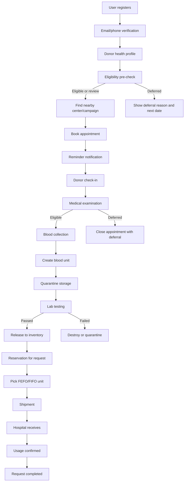

## 13. Workflow - Emergency Request

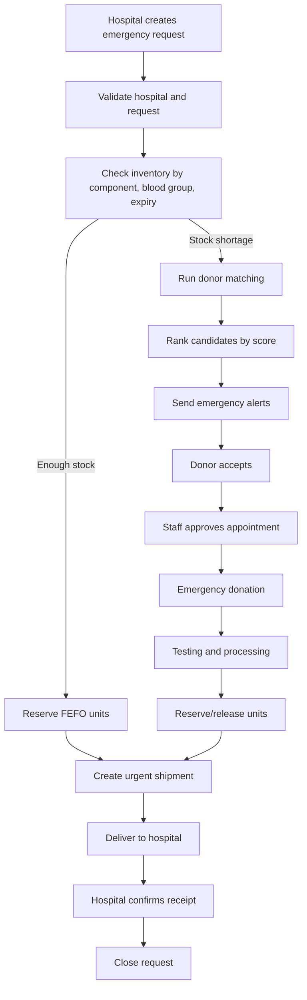

## 14. State Machines

### 14.1 User Verification

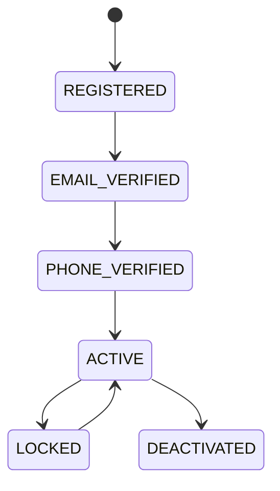

### 14.2 Donation Appointment

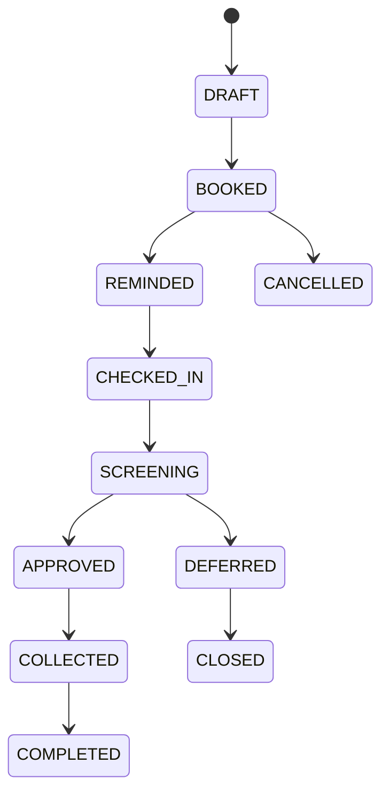

### 14.3 Medical Examination

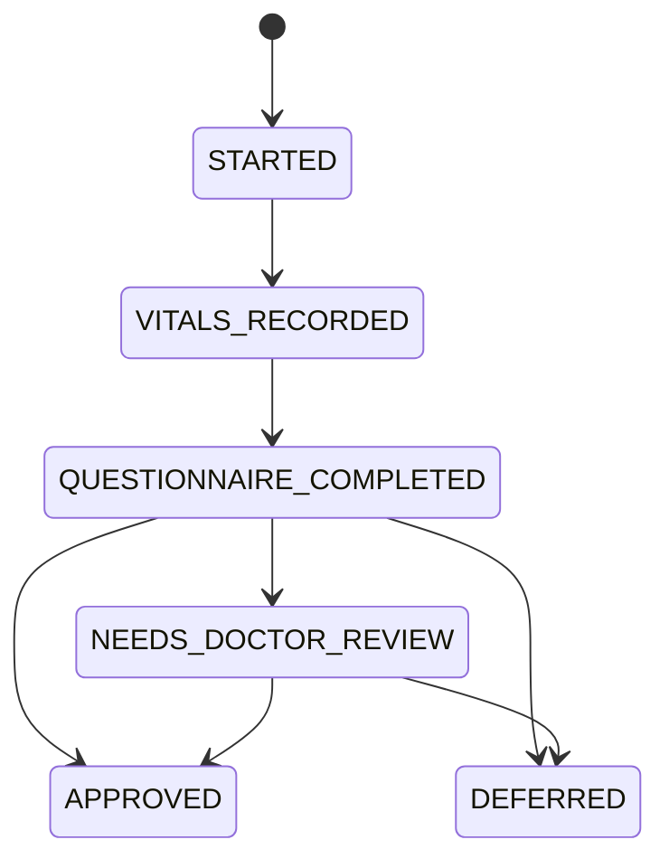

### 14.4 Blood Unit

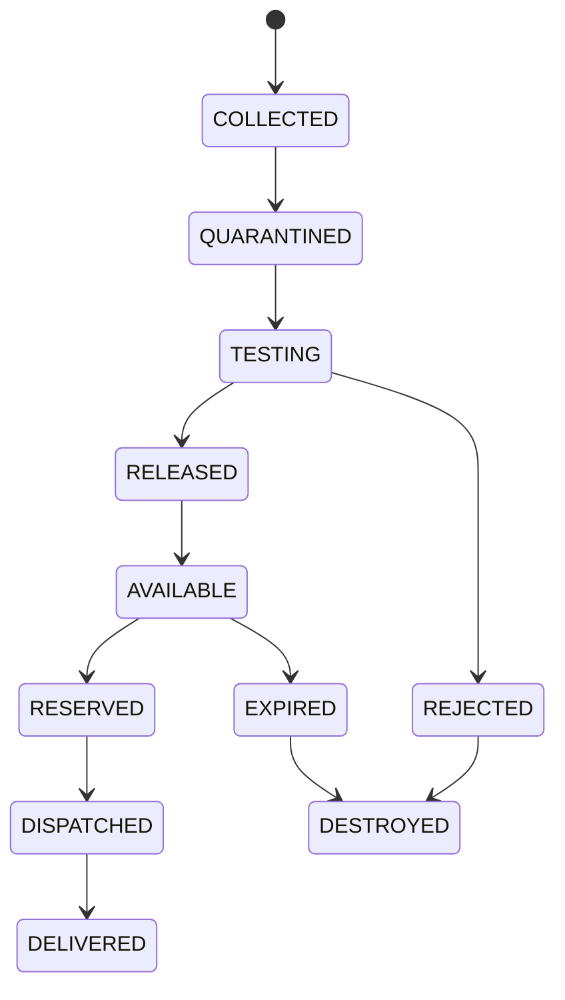

### 14.5 Blood Request

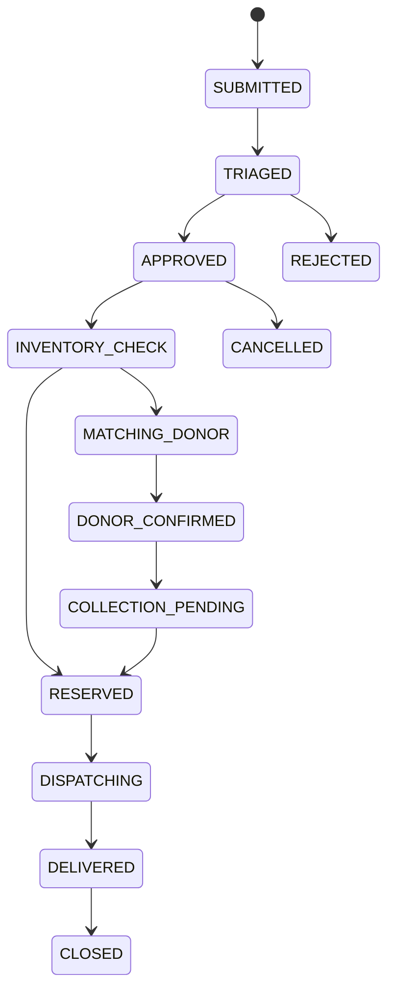

### 14.6 Shipment

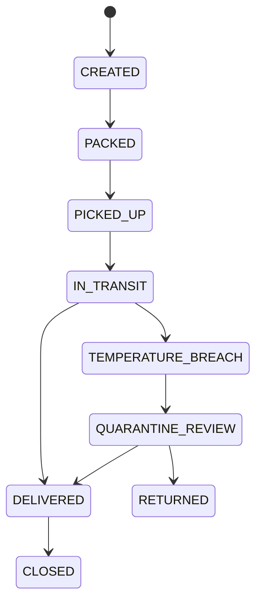

## 15. Sequence Diagrams

### 15.1 Book Donation Appointment

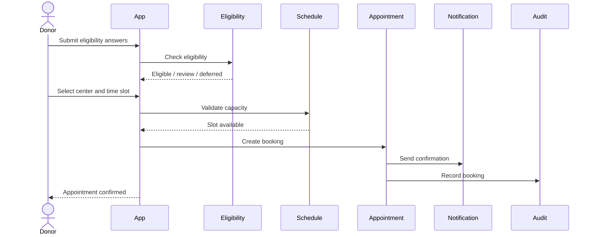

### 15.2 Emergency Request Fulfillment

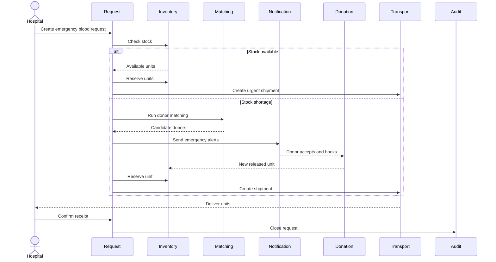

## 16. Activity Diagrams

### 16.1 Blood Inventory FEFO Reservation

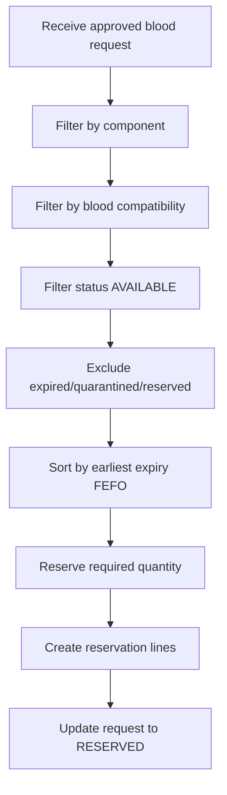

### 16.2 Donor Matching

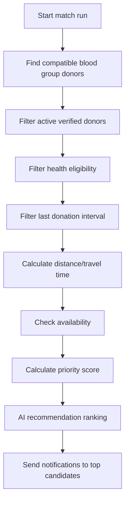

## 17. Donor Matching Rules

### 17.1 Hard Filters

- Donor account is active and verified.
- Donor consented to emergency alerts.
- Blood group compatible.
- Age and weight pass minimum rules.
- Last donation interval satisfies policy.
- No active medical deferral.
- Donor is within configured radius unless emergency override.

### 17.2 Priority Score

Example scoring model:

| Factor | Weight |
| --- | ---: |
| Blood compatibility exactness | 25 |
| Distance/travel time | 20 |
| Availability window | 15 |
| Last donation interval safety | 15 |
| Health profile confidence | 10 |
| Response history | 10 |
| Emergency rarity bonus | 5 |

`priorityScore = weighted sum, capped at 100`.

### 17.3 AI Recommendation

AI recommendation can rank donors but must not override medical safety filters. It should provide explainable factors:

- Why donor was suggested.
- Distance and expected travel time.
- Availability confidence.
- Medical safety flags.
- Last donation date.

## 18. Blood Inventory Rules

### 18.1 Component Types

- Whole Blood
- RBC
- Plasma
- Platelet
- FFP
- Cryoprecipitate

### 18.2 Inventory Policies

- FEFO for dispatch: earliest expiry first.
- FIFO for operational movement history where expiry is equal.
- Quarantined units cannot be reserved.
- Destroyed units cannot be moved.
- Expired units must be locked and scheduled for destruction.
- Reserved units cannot be reserved for another request unless reservation is released.
- Every movement creates a ledger entry.
- Every test result must be attributable to staff and timestamp.

### 18.3 Storage States

- COLLECTED
- QUARANTINED
- TESTING
- RELEASED
- AVAILABLE
- RESERVED
- DISPATCHED
- DELIVERED
- EXPIRED
- REJECTED
- DESTROYED

## 19. Geo Requirements

### 19.1 Use Cases

- Nearby hospital.
- Nearby campaign.
- Nearby donor.
- Nearby medical center.
- Travel distance and route.
- Emergency route estimate.

### 19.2 Google Maps Integration

- Geocoding for address to coordinates.
- Places/autocomplete for center/campaign search.
- Distance Matrix for travel time.
- Directions for shipment route.
- Map display with accessible list fallback.

### 19.3 Geo Data Rules

- Store canonical latitude/longitude.
- Store formatted address and administrative area.
- Cache route estimates briefly for emergency matching.
- Never expose donor exact address publicly.
- Use approximate donor location for matching until consent/acceptance.

## 20. Notification Design

### 20.1 Channels

- Email
- SMS
- Push
- Realtime websocket/SSE
- Emergency alert

### 20.2 Notification Events

- Account verification.
- Appointment confirmation/reminder.
- Eligibility result.
- Emergency donor alert.
- Hospital request approved/rejected.
- Blood reserved/dispatched/delivered.
- Certificate issued.
- Reward badge earned.
- Staff assignment.

### 20.3 Delivery Rules

- Emergency alerts use SMS + Push + realtime where available.
- Non-critical education uses email/push.
- Failed delivery creates retry attempt.
- Opt-out respected except legally/operationally required notices.
- All emergency alerts must be auditable.

## 21. API Contract

Design-level endpoints:

### Identity/RBAC

- `POST /api/auth/register`
- `POST /api/auth/login`
- `POST /api/auth/verify-email`
- `POST /api/auth/mfa/verify`
- `GET /api/users/me`
- `GET /api/admin/roles`
- `POST /api/admin/users/{id}/roles`

### Donation

- `POST /api/donations/eligibility-check`
- `GET /api/donation-locations`
- `GET /api/donation-locations/nearby`
- `GET /api/campaigns`
- `POST /api/appointments`
- `POST /api/appointments/{id}/check-in`
- `POST /api/examinations/{id}/approve`
- `POST /api/examinations/{id}/defer`
- `POST /api/collections`

### Inventory

- `GET /api/inventory/stock`
- `GET /api/inventory/units/{bagCode}`
- `POST /api/inventory/units/{id}/test-result`
- `POST /api/inventory/units/{id}/release`
- `POST /api/inventory/units/{id}/quarantine`
- `POST /api/inventory/reservations`
- `POST /api/inventory/dispatch`

### Blood Request/Emergency

- `POST /api/hospitals/{hospitalId}/blood-requests`
- `POST /api/blood-requests/{id}/triage`
- `POST /api/blood-requests/{id}/approve`
- `POST /api/blood-requests/{id}/reserve`
- `POST /api/blood-requests/{id}/close`
- `POST /api/emergency-requests`
- `POST /api/emergency-requests/{id}/match-donors`

### Matching

- `POST /api/matching/runs`
- `GET /api/matching/runs/{id}`
- `POST /api/matching/candidates/{id}/notify`
- `POST /api/matching/candidates/{id}/accept`

### Transportation

- `POST /api/shipments`
- `POST /api/shipments/{id}/pickup`
- `POST /api/shipments/{id}/checkpoint`
- `POST /api/shipments/{id}/deliver`
- `POST /api/shipments/{id}/temperature-breach`

### Reports/Analytics/Audit

- `GET /api/reports/donations`
- `GET /api/reports/inventory`
- `GET /api/reports/campaigns`
- `GET /api/reports/hospitals`
- `GET /api/reports/blood-usage`
- `GET /api/reports/donors`
- `GET /api/analytics/dashboard`
- `GET /api/audit-events`

## 22. DTO Design

### 22.1 Create Blood Request DTO

Fields:

- `hospitalId`
- `bloodGroup`
- `components[]`: componentType, quantity, unit
- `urgency`
- `requiredBy`
- `patientContext`
- `deliveryLocation`
- `notes`

### 22.2 Inventory Reservation DTO

Fields:

- `requestId`
- `reservationPolicy`: FEFO, FIFO override
- `componentRequirements[]`
- `allowCompatibleSubstitute`
- `reservedByStaffId`

### 22.3 Donor Candidate DTO

Fields:

- `donorId`
- `bloodGroup`
- `distanceKm`
- `travelMinutes`
- `lastDonationDate`
- `availabilityWindow`
- `priorityScore`
- `recommendationReason`
- `medicalFlags`

### 22.4 Shipment DTO

Fields:

- `requestId`
- `fromCenterId`
- `toHospitalId`
- `bloodUnitIds[]`
- `temperaturePolicy`
- `route`
- `courierId`
- `expectedDeliveryAt`

## 23. Permission Matrix

| Capability | Donor | Recipient/Public | Hospital Staff | Medical Center Staff | Lab Staff | Courier | Volunteer | Admin | Super Admin |
| --- | --- | --- | --- | --- | --- | --- | --- | --- | --- |
| Register account | Yes | Yes | Yes | Yes | Yes | Yes | Yes | Yes | Yes |
| Verify organization | No | No | Request | Request | No | No | No | Approve | Approve |
| Book donation | Yes | No | No | On behalf | No | No | Assist | No | No |
| View own medical profile | Yes | No | No | Limited | Limited | No | No | No | Break-glass |
| Perform examination | No | No | No | Yes | No | No | No | No | No |
| Record collection | No | No | No | Yes | No | No | No | No | No |
| Record lab result | No | No | No | No | Yes | No | No | No | No |
| View inventory | No | No | Own hospital view | Own center | Lab scope | No | No | All | All |
| Reserve blood unit | No | No | Request only | Yes | No | No | No | Yes | Yes |
| Create blood request | No | Public emergency only | Yes | Yes | No | No | Assist | Yes | Yes |
| Approve request | No | No | No | Yes | No | No | No | Yes | Yes |
| Run donor matching | No | No | No | Yes | No | No | No | Yes | Yes |
| Send emergency alert | Consent receiver | No | No | Yes | No | No | No | Yes | Yes |
| Manage shipment | No | No | Track own | Create/track | No | Update route | No | Yes | Yes |
| Issue certificate | No | No | No | Yes | No | No | No | Yes | Yes |
| Manage rewards | No | No | No | Limited | No | No | No | Yes | Yes |
| View audit logs | Own only | No | Own org | Own center | Own actions | Own actions | No | Yes | Yes |
| Manage RBAC | No | No | No | No | No | No | No | Limited | Yes |

## 24. Business Rules

### Identity/RBAC

- Staff/admin accounts require email verification and MFA.
- Organization users must belong to a verified organization.
- Role assignment changes must be audited.
- Break-glass access requires reason and elevated audit trail.

### Donation

- Donor must pass eligibility pre-check before booking.
- Final eligibility is determined by medical staff after examination.
- Appointment capacity cannot exceed schedule capacity.
- Donor cannot have overlapping active appointments.
- Donor cannot donate if medically deferred.

### Medical Examination

- Vitals and questionnaire are required before approval.
- Deferral must include reason and optional next eligible date.
- Approval must identify medical staff.

### Blood Collection

- Bag code must be globally unique.
- Collected unit starts in quarantine.
- Collection must link donor, appointment, staff and location.

### Inventory

- Unit cannot be available until tests pass.
- FEFO is default reservation strategy.
- Quarantined/rejected/destroyed units cannot be dispatched.
- Reservation must be released if request is cancelled.
- Shipment delivery must update inventory movement ledger.

### Emergency

- Emergency requests have triage priority.
- If stock is insufficient, matching starts automatically.
- Donor exact location remains private until acceptance.
- Emergency alerts require opt-in except legally approved operational notices.

### Transportation

- Shipment requires source, destination, units, courier and temperature policy.
- Temperature breach triggers quarantine review.
- Handover must record actor, time and location.

### Audit

- Audit events are append-only.
- Sensitive medical/inventory/request actions must include actor, role, entity, timestamp, IP/device and reason if applicable.

## 25. Report Design

| Report | Audience | Metrics |
| --- | --- | --- |
| Donation report | Medical center, admin | appointments, collected units, deferrals, no-shows |
| Inventory report | Medical center, hospital, admin | available, reserved, quarantined, expired, destroyed |
| Campaign report | Center, admin | turnout, capacity, conversion, units collected |
| Hospital report | Hospital, admin | requests, fulfilled, rejected, average fulfillment time |
| Blood usage report | Hospital, admin | component usage, blood group, department |
| Donor report | Center, admin | active donors, retention, eligibility, response rate |
| Emergency report | Admin | emergency count, match time, fulfillment time, outcomes |
| Transportation report | Center, admin | delivery time, route, breach count, courier performance |
| Audit report | Compliance, admin | sensitive actions, role changes, exports |

## 26. Analytics

Dashboards:

- National blood availability by blood group/component.
- Critical shortage heatmap.
- Donation campaign effectiveness.
- Donor retention and reactivation.
- Emergency request response time.
- Inventory expiry forecast.
- Hospital demand forecast.
- Geo demand/supply imbalance.
- Staff throughput and queue time.

## 27. Production Module Roadmap

### Phase 1 - Governance Foundation

- Identity/RBAC.
- Organization verification.
- Audit event baseline.
- DTO/API contract standard.

### Phase 2 - Donation Operations

- Campaigns.
- Schedules.
- Appointments.
- Eligibility.
- Medical examination.
- Collection.

### Phase 3 - Inventory and Lab

- Blood units.
- Component processing.
- Lab testing.
- Quarantine/release/destroy.
- FEFO reservation.

### Phase 4 - Requests and Emergency

- Hospital requests.
- Emergency request triage.
- Donor matching.
- Notifications.

### Phase 5 - Transportation

- Shipment.
- Cold-chain tracking.
- Route and handover.

### Phase 6 - Engagement and Insights

- Volunteer.
- Certificate.
- Reward.
- Reports.
- Analytics.
- SEO/Geo optimization.

