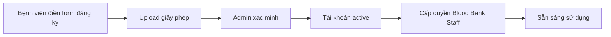
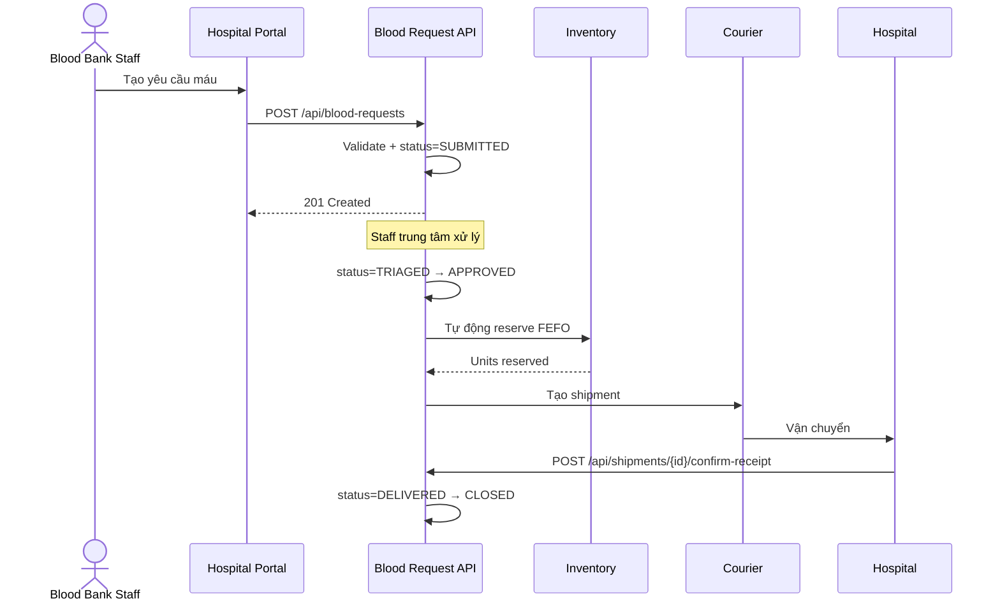
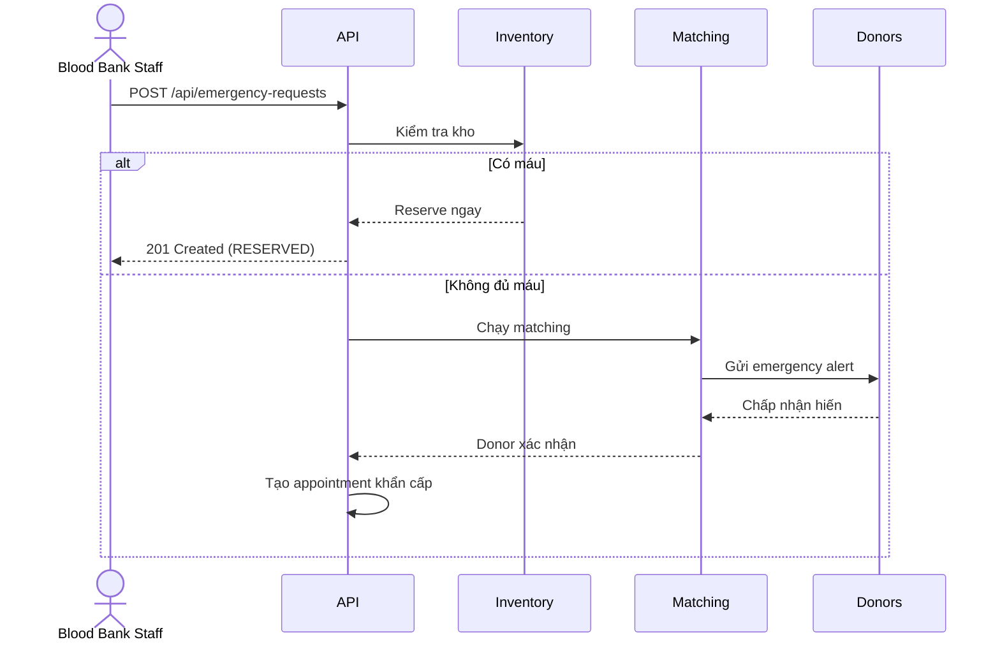

# Hospital Onboarding Guide
> **Mục tiêu:** Hướng dẫn bệnh viện tích hợp với hệ thống hiến máu cộng đồng
> **Phiên bản:** 1.0
> **Đối tượng:** IT bệnh viện, quản lý ngân hàng máu, bác sĩ phụ trách

---

## 1. Giới thiệu

Hệ thống Blood Donation Community Platform cho phép bệnh viện:
- Đăng ký tổ chức (xác minh giấy phép).
- Tạo và theo dõi yêu cầu máu (thường + khẩn cấp).
- Xem tình trạng kho máu của các trung tâm gần nhất.
- Nhận thông báo đặt phòng, vận chuyển, giao hàng.
- Xác nhận đã nhận và sử dụng máu cho bệnh nhân nào.

## 2. Quy trình đăng ký



### API đăng ký

```http
POST /api/organizations
Content-Type: application/json
Authorization: Bearer <token>

{
  "code": "BV-CR-001",
  "name": "Bệnh viện Chợ Rẫy",
  "type": "HOSPITAL",
  "licenseNumber": "BYT-2024-001234",
  "phone": "+84-28-3855-1234",
  "email": "bloodbank@choray.vn",
  "address": "201B Nguyễn Chí Thanh, Quận 5, TP.HCM",
  "latitude": 10.7550,
  "longitude": 106.6540
}
```

Response `200 OK`:
```json
{
  "success": true,
  "message": "OK",
  "data": {
    "id": 12,
    "code": "BV-CR-001",
    "name": "Bệnh viện Chợ Rẫy",
    "type": "HOSPITAL",
    "status": "PENDING_VERIFICATION",
    ...
  }
}
```

Sau khi admin xác minh, status chuyển thành `VERIFIED`. Tài khoản staff thuộc tổ chức này mới có thể tạo yêu cầu máu.

---

## 3. Các vai trò (Roles) trong bệnh viện

| Role | Quyền |
|---|---|
| `HOSPITAL_ADMIN` | Quản lý thành viên, xem tất cả báo cáo, cấu hình tổ chức |
| `HOSPITAL_BLOOD_BANK` | Tạo/xử lý yêu cầu máu, xác nhận giao hàng |
| `HOSPITAL_DOCTOR` | Xem yêu cầu của khoa mình |
| `HOSPITAL_NURSE` | Xem yêu cầu (read-only) |

---

## 4. Luồng yêu cầu máu

### 4.1 Yêu cầu thường



### 4.2 Yêu cầu khẩn cấp



---

## 5. API endpoints quan trọng cho bệnh viện

### 5.1 Xem kho máu gần nhất

```http
GET /api/inventory/stock
Authorization: Bearer <token>
```

Response:
```json
{
  "success": true,
  "message": "OK",
  "data": [
    {
      "bloodGroup": "O_POSITIVE",
      "componentType": "WHOLE_BLOOD",
      "status": "AVAILABLE",
      "quantity": 120,
      "totalVolumeMl": 48000
    }
  ]
}
```

### 5.2 Tạo yêu cầu máu

```http
POST /api/blood-requests
Content-Type: application/json
Authorization: Bearer <token>

{
  "bloodGroup": "O_POSITIVE",
  "componentType": "WHOLE_BLOOD",
  "quantityUnits": 2,
  "urgency": "HIGH",
  "requiredBy": "2026-07-28T10:00:00Z",
  "recipientInfo": "Patient #A12345 - Trauma surgery - O+ confirmed",
  "latitude": 10.7550,
  "longitude": 106.6540
}
```

### 5.3 Tạo yêu cầu khẩn cấp

```http
POST /api/emergency-requests
Content-Type: application/json
Authorization: Bearer <token>

{
  "bloodGroup": "O_NEGATIVE",
  "componentType": "WHOLE_BLOOD",
  "quantityUnits": 4,
  "recipientInfo": "EMERGENCY - Trauma bay 3",
  "latitude": 10.7550,
  "longitude": 106.6540
}
```

System tự động:
1. Tìm máu trong kho các trung tâm gần nhất.
2. Nếu đủ → reserve và thông báo courier.
3. Nếu thiếu → chạy donor matching, gửi SMS + push đến top 20 người hiến phù hợp.

### 5.4 Theo dõi yêu cầu

```http
GET /api/blood-requests/{id}
```

Trả về:
```json
{
  "success": true,
  "data": {
    "id": 1234,
    "status": "DISPATCHING",
    "bloodGroup": "O_POSITIVE",
    "quantityUnits": 2,
    "shipment": {
      "id": 567,
      "courierName": "Nguyen Van A",
      "courierPhone": "+84-9xx-xxx-xxx",
      "estimatedArrival": "2026-07-28T11:30:00Z",
      "trackingUrl": "https://maps.google.com/?q=10.7,106.6"
    }
  }
}
```

### 5.5 Xác nhận đã nhận máu

```http
POST /api/shipments/{id}/confirm-receipt
Content-Type: application/json

{
  "receivedBy": "Nguyen Van B - Blood Bank",
  "receivedAt": "2026-07-28T11:25:00Z",
  "condition": "GOOD",
  "temperatureReading": 4.2,
  "patientReference": "Patient #A12345",
  "notes": "Used in trauma surgery, successful"
}
```

Sau khi xác nhận, đơn vị máu được liên kết với bệnh nhân (`BloodUnitUsage`) cho mục đích truy nguyên.

---

## 6. SLA và cam kết

| Mức độ | Thời gian phản hồi | Phản hồi của hệ thống |
|---|---|---|
| `CRITICAL` | ≤ 15 phút | Tự động reserve + bắt đầu matching |
| `HIGH` | ≤ 1 giờ | Triage trong vòng 30 phút |
| `MEDIUM` | ≤ 6 giờ | Triage trong vòng 2 giờ |
| `LOW` | ≤ 24 giờ | Triage trong vòng 8 giờ |

Nếu vi phạm SLA, hệ thống tự động thông báo cho admin.

---

## 7. Tích hợp với HIS/EMR (tùy chọn)

Bệnh viện có thể tích hợp với hệ thống HIS/EMR hiện có qua:

1. **HL7 FHIR endpoint:** `/fhir/BloodRequest` (planned Phase 5+).
2. **Webhook:** đăng ký webhook URL để nhận thông báo status changes.
3. **Embedded portal:** iframe vào giao diện HIS.

Liên hệ tích hợp: `integrations@bloodconnect.vn`

---

## 8. Bảo mật & Tuân thủ

- Tất cả dữ liệu y tế được mã hóa khi truyền (TLS 1.3) và lưu trữ (AES-256).
- Mọi truy cập đều có audit log (ai, lúc nào, làm gì).
- Tuân thủ Nghị định 13/2023/NĐ-CP về bảo vệ dữ liệu cá nhân Việt Nam.
- MFA bắt buộc cho mọi tài khoản nhân viên y tế.
- Phiên đăng nhập tự động hết hạn sau 30 phút không hoạt động.

---

## 9. Hỗ trợ

- Hotline: 1900-XXXX (24/7)
- Email: `hospitals@bloodconnect.vn`
- Slack channel: `#hospital-onboarding` (sau khi ký NDA)
- Documentation: https://docs.bloodconnect.vn